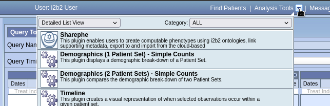

#  Sharephe Plug-in

[](https://opensource.org/licenses/MPL-2.0)
[](https://github.com/kvb2univpitt/sharephe/releases/tag/v0.1.0)

An i2b2 webclient plug-in that improves sharing and translating computable phenotypes for clinical and translational research.

## What can Sharephe Plug-in do?

- provide user friendly data creation and query tool
- structure clinical data into standard query format
- use standardized terminologies and facilitate reuse of value sets
- shareable, executable and reusable for cross-sites research
- support translation among variety of data model(in progress)
- both human readable and computer readable version of phenotypes

## Installing the Plugin

Assume that the i2b2 webclient is located in the following directory on the server:

```text
/var/www/html/webclient
```

### Copying the Plugin to the i2b2 Web Client

Copy the folder named ***Sharephe***, located in the project folder ```sharephe/plugin```, to the i2b2 webclient directory ```/var/www/html/webclient/js-i2b2/cells/plugins/standard```.

For an example, the Sharephe plugin directory should be:

```text
/var/www/html/webclient/js-i2b2/cells/plugins/standard/Sharephe
```

### Registering the Plugin with the i2b2 Webclient

To register the plug-in with the i2b2 webclient, add the following Sharephe plugin configuration to the array ***i2b2.hive.tempCellsList*** in the module loader configuration file **i2b2_loader.js** located in the i2b2 webclient directory ```/var/www/html/webclient/js-i2b2```:

```js
{code: "Sharephe",
    forceLoading: true,
    forceConfigMsg: {params: []},
    forceDir: "cells/plugins/standard"
}
```

For an example, the **i2b2_loader.js** file should look similar to this:

```js
i2b2.hive.tempCellsList = [
    {code: "PM",
        forceLoading: true 			// <----- this must be set to true for the PM cell!
    },
    {code: "ONT"},
    {code: "CRC"},
    {code: "WORK"},
    {code: "Sharephe",
        forceLoading: true,
        forceConfigMsg: {params: []},
        forceDir: "cells/plugins/standard"
    },
    ...
];
```

For more information on installing the plug-in, please visit [Web Client Plug-in Developers Guide](https://community.i2b2.org/wiki/display/webclient/Web+Client+Plug-in+Developers+Guide).

### Configuring the Plugin

#### Setting the REST API URL

Set the value for ***i2b2.Sharephe.rest.url*** in the file **Sharephe_rest_services.js** located in the directory ```/var/www/html/webclient/js-i2b2/cells/plugins/standard/Sharephe/Sharephe_rest_services.js``` to the following URL:

```text
https://dev.sharephe.dbmi.pitt.edu/api
```

For an example:

```js
i2b2.Sharephe.rest.url = 'https://dev.sharephe.dbmi.pitt.edu/api';
```

> Note that the URL above is for development and is subject to change.

## Using the Plugin

### Loading the Plugin

1. Log on into the i2b2 web client.

    

2. Click on the ***Analysis Tools*** drop-down.

    

3. Select the **Sharephe** plugin

    

4. You should see a list of phenotypes fetched from the cloud.

    

### Viewing Phenotype

1. Move the mouse pointer over to a row in the phenotype table and click on it.  The row will be highlighted (light gray) when the mouse pointer is hover over it.

    

2. You should see the phenotype workbook in the ***Workbook*** tab.

    

3. Click on the ***Details*** tab to see the concepts for the queries.

    

> Note that the ***Details*** tab is only viewable if there are queries saved in the phenotype workbook.

### Create New Workbook

1. Log on to the i2b2 web client.

2. Click on the ***Analysis Tools*** drop-down.

    

3. You should see a list of workbooks fetched from the cloud.

    

4. Select **Workbook** tab.

    

5. Populate the form and Click on ***Save and Publish** button to create a new workbook.

    

6. You should see a confirmation message pop-up.

    
