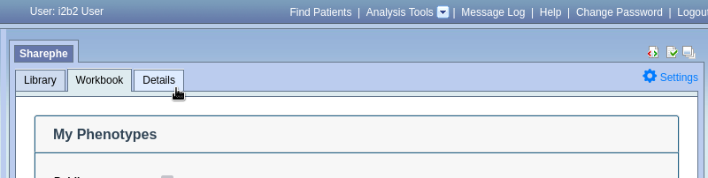

#  Sharephe Plug-in User Guide

A user guide for using the Sharephe plug-in.

## Introduction

### Workbook

Phenotypes are stored in a form called ***workbook***.  A workbook holds additional information relating to the phenotype such as i2b2 XML queries, files, authors, etc.

The workbook can be marked ***public*** or ***private***.  Workbooks that are marked ***public*** are publicly available for everyone to view.  However, only the owner (creator) of the workbook can modify the contents.  Workbooks that are marked ***private*** are not visible for the users to see.  The users must set their API key to view and modify their private workbooks.

> Note that the owner of the workbook is the user who created the workbook.  The owner can be an author of the workbook.  But, the authors of the workbook are not necessarily the owners of the workbook.

### Tabs

The Sharephe plug-in has the following tabs for working with phenotypes:

<dl>
    <dt>Library</dt>
    <dd>
        This is tab contains a list of phenotypes (workbook) stored from the cloud.  By the default, the list will only show phenotypes that are marked <b><i>public</i></b>.  To show <b><i>private</i></b> phenotypes, the users must set their API keys in the <b>settings</b> menu.
    </dd>
    <dd>
    The workbooks can searched using workbook (phenotype) ID, type, title, author, institution, and files.
    </dd>
    <dt>Workbook</dt>
    <dd>
    This tab shows the contents of the selected workbook from the list in the <b>Library</b> tab.  Here is where users can execute the queries saved to the workbook.  If an API key is set, the users can modify their existing workbook or create a new workbook.
    </dd>
    <dd>
    This tab is disabled if no workbook is selected from the list or if no API key is set.  If a user AIP key is set, users can click on this tab to create a new workbook.
    </dd>
    <dt>Details</dt>
    <dd>
    This tab will show all of the concepts from the query saved to the workbook.  The users can export the list of concepts to a file in tabular format (CSV) or a JSON format.  The user can also copy the content to a clipboard in either format.
    </dd>
    <dd>
    If the workbook does not have query saved, the tab will be disabled (users cannont click on it).
    </dd>
</dl>

### User API Key

User API key is not required to view phenotype workbook that are marked ***public***.  User API key is used for the following purposes:

- Viewing user's created phenotype workbooks that are marked ***private***.
- Editing user's created phenotype workbooks.
- Create a new phenotype workbook.

> **Warning**
> DO NOT share your API key with anyone!

## Launching the Plug-in

1. Log on into the i2b2 Web Client.

    

2. Click on the ***Analysis Tools*** drop-down.

    

3. Select the Sharephe plug-in by clicking on the ***Sharephe*** option.

    

4. You should see a list of phenotypes fetched from the cloud.

    

## Adding User API Key

### Obtaining a User API Key

Users can obtain an API key from the [Sharephe's web application](https://dev.sharephe.dbmi.pitt.edu/) by logging into their account.

1. Click on the ***Login*** button to log in.

    

2. Select the organization to sign in with and click on the ***Continue*** button to start the signing in process.

    

3. Once logged in, click on the user icon on the right-hand side and select ***Profile*** from the drop-down menu.

    

4. Go down to the **API Key** section.  You should see your API key.  The API key is masked to hide from public view.  To unmasked the API key, click on the eye icon.

    

    > You can choose to create a new API key by clicking on the ***Generate New API Key*** button.  It is good practice to change your API key often in case it got stolen.  Make sure to update the plug-in with the new API key.

5. Click on the clipboard icon to copy the API key.

    

> **Warning**
> DO NOT share your API key with anyone!

### Setting the API Key

Once the API is copied from the above instruction, the users must set their API key in the plug-in.

1. Click on the **Settings** link located on the right-hand side.

    

2. Paste or type in the API key and click **Set API Key** button.

    

3. Click the **OK** button of the notfication modal to close.  Click the **OK** button of the Settings menu to close.

    

## Viewing a Phenotype

1. Click on a phenotype from the list in the ***Library*** tab.

    

2. You should see the contents of the workbook in the ***Workbook*** tab.

    

    ### Opening Attachements

    If there are any file attachements, click on the file name to open up the file in a new tab.

    

    ### Running Queries

    If there are any queries, click on the ***Run Query*** button next to the query to execute the query.

    

    Query is running.

    

    Click on ***Back to Sharephen*** button to go back to the workbook.

    

3. Click on the ***Details*** tab to see the concepts for all of the queries.

    

    Showing query concepts:

    

    > Note that the ***Details*** tab is only viewable if there are queries saved in the phenotype workbook.
