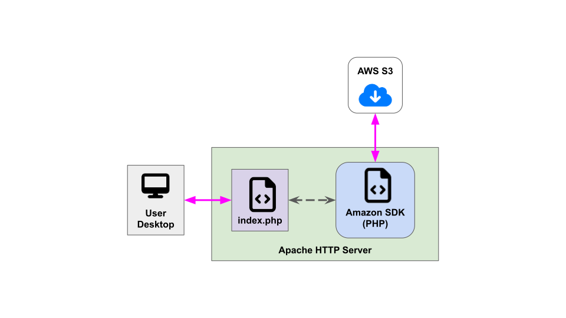

#  Sharephe Tools

A web application for non-i2b2 users to view and download (read-only) shared phenotypes.

<figure>
    
    <figcaption align="center">
        <b>Fig. 1 - The Sharephe Tools web application flow.</b>
    </figcaption>
</figure>

The Sharephe Tools is a web application written in PHP and uses the following libraries:

- [Bootstrap](https://getbootstrap.com/docs/5.2/getting-started/introduction/) - A web frontend toolkit for building UI.
- [Bootstrap Icons](https://icons.getbootstrap.com/) - A free, high quality, open source icon library.
- [jQuery](https://jquery.com/) - A Javascript library for HTML document manipulation and for server communication.
- [DataTables](https://datatables.net/) - A table enhancing plug-in for the jQuery Javascript library.
- [AWS SDK for PHP](https://aws.amazon.com/sdk-for-php/) - A PHP library for communication with the AWS cloud services.

> The Sharephe Tools does not communicate with i2b2 cells.  It uses AWS SDK to directly commuicate with Amazon DynamoDB.
