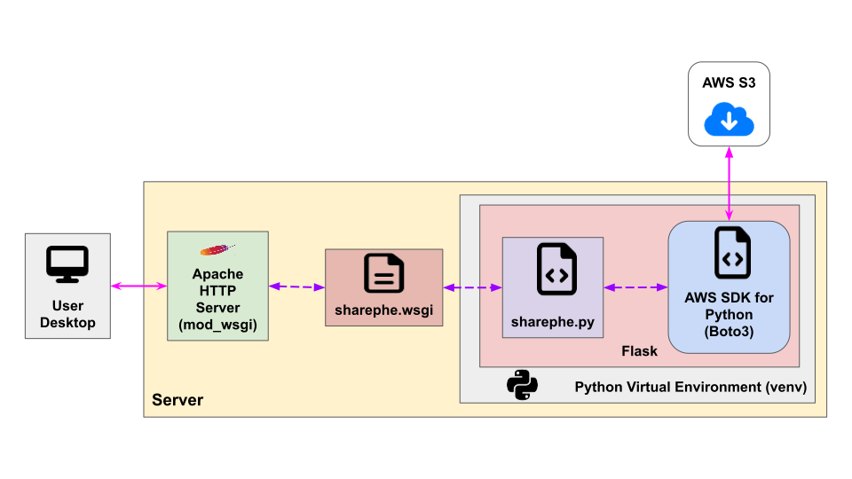

#  Sharephe Tools

A web application for non-i2b2 users to view (read-only) shared phenotypes.

<figure>
    
    <figcaption>
        <b>Fig. 1 - The Sharephe Tools web application flow.</b>
    </figcaption>
</figure>
